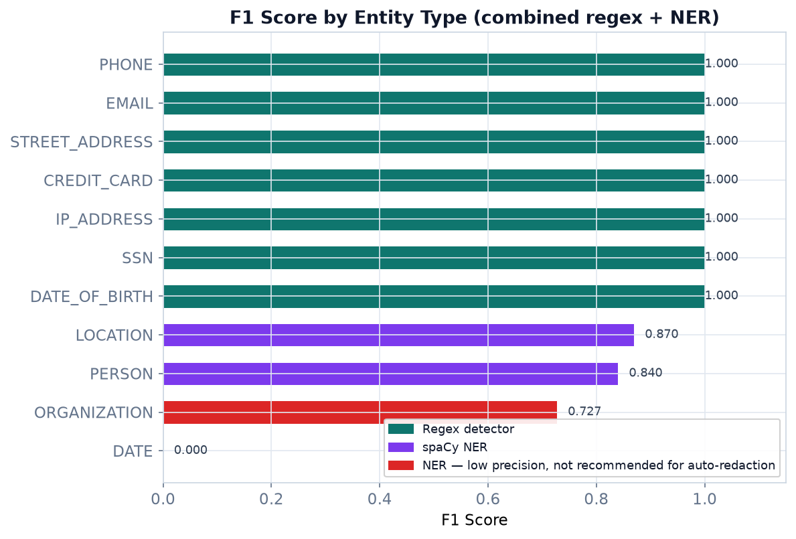
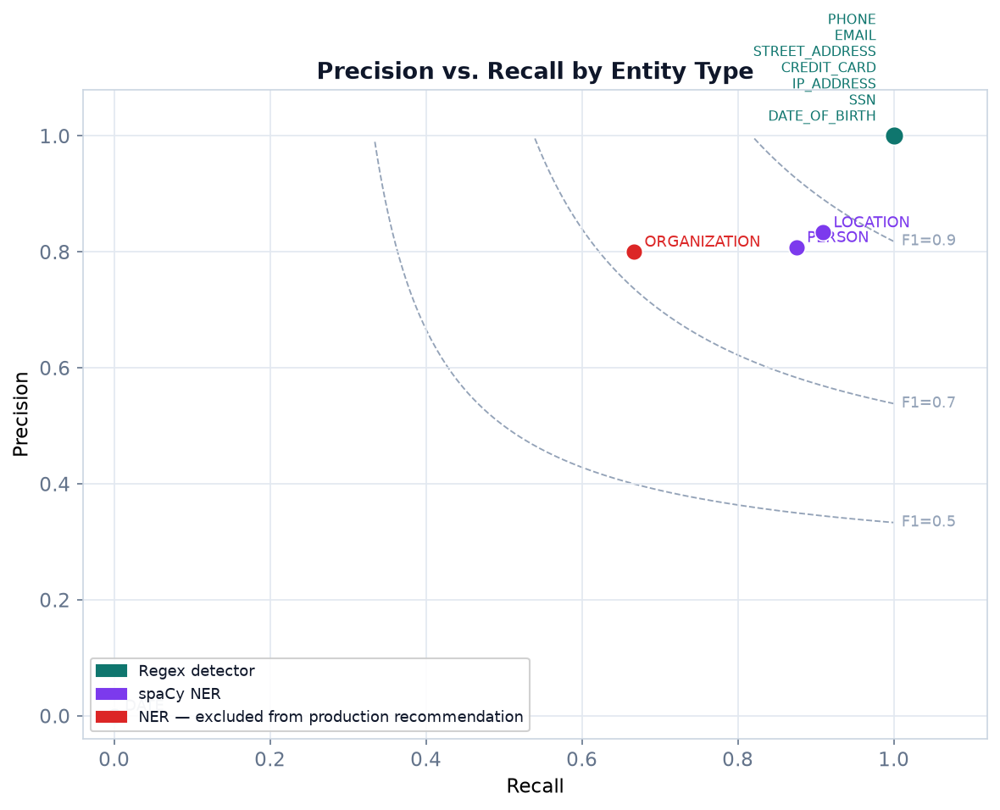
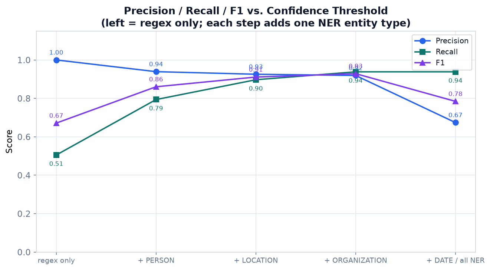
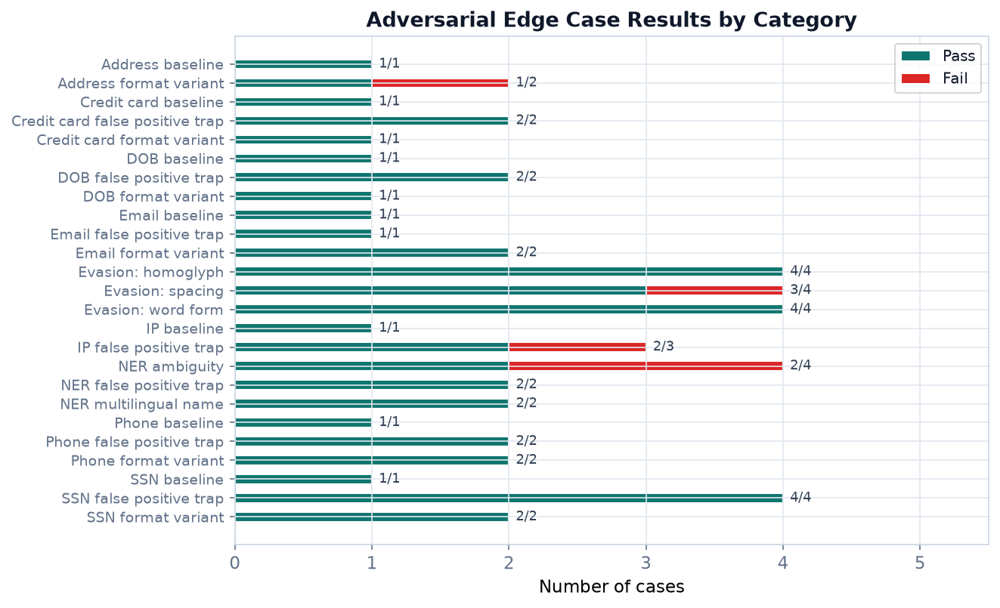

# PII Detection and Redaction Pipeline

[](https://github.com/mn3040/pii-detection-and-redaction/actions/workflows/tests.yml)

Most PII detection tools are configuration files on top of a black box. You
point them at data, get flags back, and have no clear sense of what fired or
why. I wanted to understand how the rules actually work, so I built every
detector from scratch — then benchmarked it against Microsoft Presidio to see
where a purpose-built pipeline wins and where it loses.

This project scans `.txt`, `.csv`, and `.json` files for personally identifiable
information using two layers: strict regex rules for structured formats (SSNs,
emails, phones, credit cards, IPs, addresses, dates of birth) and a spaCy NER
model for unstructured text (names, places, organizations). It reports exact
character spans, writes redacted copies, evaluates precision and recall against
synthetic labeled data, and includes an adversarial test suite that probes
evasion techniques regex-based detection cannot handle.

**Try it live:** https://mn3040.github.io/pii-detection-and-redaction/

## What It Does

- Detect SSNs, emails, phone numbers, credit cards, IP addresses, street
  addresses, and dates of birth using purpose-built regex detectors.
- Detect names, locations, and organizations using spaCy NER with a
  post-filter that rejects detections that fail a legitimacy check.
- Write a findings report (JSON or CSV) with entity type, matched text,
  character span, confidence score, source file, and line number.
- Write redacted copies with `[REDACTED_TYPE]` placeholders, resolving overlaps
  before masking so offsets never corrupt.
- Evaluate against a synthetic test set, an adversarial edge-case suite, and
  the CoNLL-2003 newswire corpus for domain-transfer measurement.
- Compare directly against Microsoft Presidio on the same test set.

## Why I Built This

Production PII tools are designed for compliance workflows. They hide the
detection logic behind policy files and dashboards.

I wanted to understand the rules instead of trusting them. This project focuses
on transparency: every regex is annotated, every confidence score is derived from
a documented heuristic, and the evaluation pipeline makes it clear exactly where
the detectors succeed and where they fall short. Building from scratch and then
benchmarking against a production library is the only honest way to know what
the tradeoffs actually are.

## Architecture

Every detector follows the same contract:

```text
detect(text) -> List[PartialDetection]
```

Detectors return `PartialDetection` objects — matched text, span, entity type,
confidence score. The engine adds source-file context and promotes each one to a
full `Detection`. The redactor either writes a report or replaces selected spans
in place.

```text
Input files
    └── PIIEngine
            ├── RegexDetector × 7   →  PartialDetection list
            └── SpacyNERDetector    →  PartialDetection list
                        │
                    promote to Detection (source_file, line_number)
                        │
                    Redactor
                        ├── write_report()          → JSON / CSV
                        └── write_masked_directory() → redacted copies
```

That contract keeps new PII types small: add a detector class, register it, and
the CLI, reporting, masking, and evaluation code continue to work unchanged.

Detectors are defined as a `Protocol` rather than a base class. That means any
object with the right `detect` method signature is a valid detector — nothing to
subclass, no boilerplate to inherit. Python's structural typing checks the
interface is satisfied without enforcing a class hierarchy.

## Project Layout

```text
pii_scan.py                   CLI entry point
engine.py                     Orchestrates detectors over input files
redactor.py                   Report writer and mask writer
detectors/
  base.py                     Detection dataclasses and Detector protocol
  regex_detectors.py          Structured PII detectors
  ner_detector.py             spaCy NER wrapper with legitimacy post-filter
data_gen/
  generate_test_data.py       Synthetic labeled test set generator
eval/
  evaluate.py                 Precision / recall / F1 with threshold sweep
  adversarial_cases.py        Hand-crafted edge cases and evasion tests
  conll_eval.py               CoNLL-2003 domain-transfer evaluation
  presidio_compare.py         Side-by-side comparison vs. Microsoft Presidio
  plots.py                    Generates all charts from live eval results
  test_dataset/               Generated labels and text
docs/
  assets/                     Charts generated by eval/plots.py
  index.html / app.js / ...   GitHub Pages browser demo
tests/                        pytest unit tests
sample_data/                  Example input file
requirements.txt
```

## Setup

```bash
python -m venv venv
source venv/Scripts/activate      # Windows Git Bash
pip install -r requirements.txt
python -m spacy download en_core_web_sm
```

On Windows PowerShell:

```powershell
venv\Scripts\Activate.ps1
```

## Run the CLI

Write a findings report without touching the source files:

```bash
python pii_scan.py --input ./sample_data --mode report --output results.json
```

Write redacted copies to a separate directory:

```bash
python pii_scan.py --input ./sample_data --mode mask --output ./redacted
```

Useful options:

| Flag | Purpose |
|---|---|
| `--no-ner` | Run only regex detectors — faster, zero false positives from NER |
| `--spacy-model en_core_web_trf` | Use a larger spaCy model when accuracy matters more than speed |

## Example

Input:

```text
Hi, my name is John Smith and I live in Chicago.
You can reach me at john.smith@example.com or call (312) 555-0198.
My SSN is 412-34-5678 and my card number is 4532015112830366.
```

Masked output:

```text
Hi, my name is [REDACTED_PERSON] and I live in [REDACTED_LOCATION].
You can reach me at [REDACTED_EMAIL] or call [REDACTED_PHONE].
My SSN is [REDACTED_SSN] and my card number is [REDACTED_CREDIT_CARD].
```

Report entry:

```json
{
  "entity_type": "SSN",
  "text": "412-34-5678",
  "start": 10,
  "end": 21,
  "confidence": 1.0,
  "source_file": "sample_data/sample.txt",
  "line_number": 3,
  "detector": "regex"
}
```

## How the Detectors Work

### Regex detectors (`detectors/regex_detectors.py`)

Each regex detector targets one PII format. Confidence is `1.0` for all regex
matches — if the pattern fires, the format is exact by definition.

**SSN** — Matches `NNN-NN-NNNN` and rejects SSNs the Social Security
Administration has never issued: area codes `000`, `666`, and `900`–`999`;
group codes `00`; serial codes `0000`. These exclusions are written as negative
lookaheads so they filter without consuming characters.

**Email** — Matches the local part, `@`, domain, and TLD. Handles subdomains and
plus-addressing (`jane+work@sub.example.co.uk`).

**Phone** — Matches US formats with dashes, dots, parentheses, or spaces, with
an optional `+1` country code. Lookbehind and lookahead assertions prevent the
pattern from matching a slice out of a longer digit string so a credit card
number never produces a phone hit.

**Credit card** — Matches 13–19 digit strings with optional space or dash
separators, then runs a Luhn checksum before accepting the match. The Luhn
algorithm is a checksum used by every major card network to catch transcription
errors. Walk the digit string right to left: double every second digit, subtract
9 from any result above 9, sum everything. A valid card number sums to a
multiple of 10. This means the detector never flags a random 16-digit number —
only structurally valid card numbers pass.

**IP address** — Matches four dot-separated octets and validates each one against
`0`–`255` by enumerating valid ranges (`25[0-5]`, `2[0-4]\d`, `1\d{2}`,
`[1-9]\d`, `\d`) rather than matching any three-digit sequence.

**Street address** — Matches a street number followed by a capitalized name and a
recognized suffix word. The suffix list covers 60+ USPS street suffix types
including full words (`Street`, `Avenue`, `Trail`) and abbreviations (`St`,
`Ave`, `Trl`), as well as less common types Faker generates (`Loop`, `Cove`,
`Forest`, `Mews`). Confidence is `0.85`.

**Date of birth** — Matches `MM/DD/YYYY`, `YYYY-MM-DD`, and `MM-DD-YYYY` with
the year range restricted to `1900`–`2019`. Dates in the current decade are
excluded to avoid flagging recent timestamps. Confidence is `0.8`.

### NER detector (`detectors/ner_detector.py`)

The spaCy detector runs `en_core_web_sm` and maps entity labels to the
pipeline's entity types. After spaCy returns results, an `_is_valid_org`
post-filter screens every ORGANIZATION detection:

1. **Blocklist check** — single tokens like `SSN`, `Card`, `Email` are rejected
   immediately. These are the most common false positives from small NER models
   on structured-PII text.
2. **Legitimacy check** — the detection is accepted only if it contains a
   recognized corporate suffix (`Inc`, `LLC`, `Corp`, `University`, etc.) or is
   at least two words long.

This filter improved ORGANIZATION precision from 0.227 to 0.800 — the
difference between a detector that's noise and one that's useful.

Confidence scores are heuristics, not calibrated probabilities:

| spaCy label | Maps to | Confidence |
|---|---|---:|
| PERSON | PERSON | 0.75 |
| GPE | LOCATION | 0.70 |
| ORG | ORGANIZATION | 0.65 |
| DATE | DATE | 0.60 |

These exist so the redactor can resolve conflicts when a regex match and a NER
match overlap — higher confidence wins.

### Overlap resolution (`redactor.py`)

Before any span is replaced, `_resolve_overlaps` sorts all detections by
confidence descending (then by span length as a tiebreaker), iterates, and skips
any detection whose span touches an already-claimed one. Replacements are applied
right-to-left so earlier offsets stay valid throughout.

## Evaluation

### What the test set does and does not prove

The primary test set is synthetic: `data_gen/generate_test_data.py` uses Faker
to generate fake PII and writes ground-truth spans to
`eval/test_dataset/labels.json`, so the repository never contains real personal
data. This is deliberate — but it creates a circularity worth naming. Faker
produces SSNs with dashes, emails in standard form, and US-format phone numbers.
The regex detectors were written with those exact formats in mind, so near-perfect
regex scores on Faker data are partly self-fulfilling.

Three things break that circularity: a hand-crafted adversarial suite covering
evasion techniques, a domain-transfer check against the CoNLL-2003 newswire
corpus, and a direct comparison against Microsoft Presidio on the same test set.

Run everything:

```bash
python data_gen/generate_test_data.py   # regenerate synthetic test set
python eval/evaluate.py                 # main eval with threshold sweep
python eval/adversarial_cases.py        # edge cases and evasion analysis
python eval/conll_eval.py               # domain-transfer (requires: pip install datasets)
python eval/presidio_compare.py         # vs. Microsoft Presidio
python eval/plots.py                    # regenerate all charts from live results
```

### Synthetic test set results



| Detector set | Precision | Recall | F1 |
|---|---:|---:|---:|
| Regex only | 1.000 | 0.577 | 0.732 |
| NER only | 0.443 | 0.361 | 0.398 |
| Combined (threshold ≥ 0.65) | 0.919 | 0.938 | 0.929 |

The recommended operating point is confidence threshold ≥ 0.65. At this
threshold, PERSON, LOCATION, and ORGANIZATION are included; NER DATE
detections are excluded. spaCy's `DATE` entity matches all dates — meeting
dates, publication dates, timestamps — not just birth dates. Including it at
threshold ≥ 0.60 drops overall precision from 0.919 to 0.674 with no recall
gain, because every NER-detected date is a false positive relative to our
`DATE_OF_BIRTH` ground truth.

### Precision-recall by entity type



| Entity type | Precision | Recall | F1 | Detector |
|---|---:|---:|---:|---|
| SSN | 1.000 | 1.000 | 1.000 | regex |
| EMAIL | 1.000 | 1.000 | 1.000 | regex |
| PHONE | 1.000 | 1.000 | 1.000 | regex |
| CREDIT_CARD | 1.000 | 1.000 | 1.000 | regex |
| IP_ADDRESS | 1.000 | 1.000 | 1.000 | regex |
| DATE_OF_BIRTH | 1.000 | 1.000 | 1.000 | regex |
| STREET_ADDRESS | 1.000 | 1.000 | 1.000 | regex |
| PERSON | 0.808 | 0.875 | 0.840 | NER |
| LOCATION | 0.833 | 0.909 | 0.870 | NER |
| ORGANIZATION | 0.800 | 0.667 | 0.727 | NER + filter |

STREET_ADDRESS improved from F1 0.333 to 1.000 after expanding the suffix list
from 10 to 60+ USPS suffix types. ORGANIZATION improved from F1 0.357 to 0.727
after adding the `_is_valid_org` post-filter. Both were diagnosed by examining
actual Faker output rather than assuming the patterns were correct.

### Confidence threshold sweep



| Threshold | What's included | Precision | Recall | F1 |
|---|---|---:|---:|---:|
| ≥ 1.00 | Regex only | 1.000 | 0.505 | 0.671 |
| ≥ 0.75 | + PERSON | 0.939 | 0.794 | 0.860 |
| ≥ 0.70 | + LOCATION | 0.926 | 0.897 | 0.911 |
| ≥ 0.65 | + ORGANIZATION | 0.919 | 0.938 | **0.929** |
| ≥ 0.60 | + NER DATE (not recommended) | 0.674 | 0.938 | 0.784 |

### Comparison against Microsoft Presidio

Presidio is Microsoft's production-grade open-source PII detection library.
Running both systems against the same test set shows exactly where a
purpose-built pipeline wins and where it loses.

| Entity type | Presidio F1 | Ours F1 | Winner |
|---|---:|---:|---|
| DATE_OF_BIRTH | 0.103 | 1.000 | **Ours** |
| PHONE | 0.857 | 1.000 | **Ours** |
| LOCATION | 0.800 | 0.870 | **Ours** |
| PERSON | 0.863 | 0.840 | Presidio |
| EMAIL | 1.000 | 1.000 | Tie |
| CREDIT_CARD | 1.000 | 1.000 | Tie |
| SSN | 1.000 | 1.000 | Tie |
| IP_ADDRESS | 1.000 | 1.000 | Tie |

Run `python eval/presidio_compare.py` to reproduce. The DATE_OF_BIRTH gap is a
methodology difference: Presidio detects all dates and reports everything as
`DATE_TIME`, which produces massive false positives against our birth-date-only
ground truth. Our year-range filter (`1900`–`2019`) is the reason for the
difference. The PHONE and LOCATION wins reflect genuine pattern differences.

STREET_ADDRESS is excluded from this comparison — Presidio has no dedicated
street address recognizer.

### Adversarial robustness

Regex-based PII detection is trivially evadable. The adversarial suite documents
this explicitly rather than pretending otherwise.



**Evasion techniques that work against this pipeline:**

- **Spacing**: `j o h n @ e x a m p l e . c o m` — inserting spaces breaks every
  regex pattern. Recall drops to zero for any spaced PII.
- **Unicode homoglyphs**: replacing `@` with fullwidth `＠` (U+FF20) or Latin
  `a` with Cyrillic `а` (U+0430) produces text that looks identical to a human
  but does not match ASCII patterns.
- **Word form**: writing `"four one two dash three four dash five six seven eight"`
  instead of `412-34-5678` requires semantic understanding that pattern matching
  cannot provide.

These are not bugs — they are the fundamental limitation of the approach. A
production system addresses them with normalization preprocessing (homoglyphs),
a larger NER model or LLM (word-form), and acceptance that a motivated adversary
can always evade a rule-based system. The point of documenting them is to make
that boundary explicit.

### Domain transfer: CoNLL-2003

CoNLL-2003 is Reuters newswire from 1996 labeled with PERSON, ORG, and LOC. It
has no structured PII, so only the NER detector can be compared here. Running
`eval/conll_eval.py` shows performance on text the system was not designed for.
Scores are lower than on the Faker test set — that is the honest cost of domain
shift, not a calibration issue.

### Production recommendation

| Entity type | Recommended for automated redaction? |
|---|---|
| SSN, EMAIL, PHONE, CREDIT_CARD, IP_ADDRESS, DATE_OF_BIRTH | Yes — regex, precision 1.0 |
| STREET_ADDRESS | Yes — precision 1.0, recall 1.0 on standard US formats |
| PERSON, LOCATION | Yes — NER, precision 0.81–0.83 |
| ORGANIZATION | With review — precision 0.80 after filter, but recall 0.67 |
| NER DATE | No — use DATE_OF_BIRTH regex instead |

Use confidence threshold ≥ 0.65 as the default operating point. Use `--no-ner`
for structured-only scans where precision matters more than recall.

## GitHub Pages Demo

The `docs/` directory is a client-side reimplementation of the regex detector
layer — no Python backend, nothing sent to a server. It runs the same seven
detectors in JavaScript, renders detections as color-coded inline highlights
with hover tooltips, and shows the masked output and a detections table side
by side.

The JS port mirrors the Python detector logic directly. The Luhn algorithm, the
SSN exclusion lookaheads, the phone lookbehind — all of it is in
`docs/detectors.js`, readable and testable in the browser console.

Deployment is handled by `.github/workflows/pages.yml`, which publishes `docs/`
to GitHub Pages whenever `main` changes.

## Tests

```bash
pytest tests/
```

`tests/test_detectors.py` covers all seven regex detectors and the overlap
resolver — 42 tests total. SSN tests include the invalid-area-code exclusions
and span accuracy; credit card tests call `_luhn_valid` directly and cover
space- and dash-separated formats; overlap tests verify that higher confidence
wins, longer spans win on ties, non-overlapping detections are both kept, and
three-way overlaps resolve to the single best detection.

## Out of Scope

This version intentionally excludes OCR and image detection, multilingual
models, and production access controls. The goal is a focused text pipeline with
transparent behavior and measurable accuracy. For production deployments, see
Microsoft Presidio or AWS Comprehend — this project's value is in the
explainability and the documented tradeoffs, not in replacing those tools.
