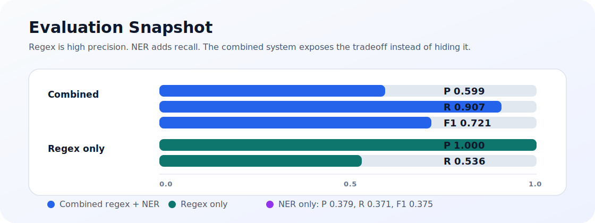

# PII Detection and Redaction Pipeline

Privacy engineering project for detecting and redacting personally identifiable
information in `.txt`, `.csv`, and `.json` files. The pipeline combines strict
regex rules with spaCy named-entity recognition, then reports exact spans or
writes masked copies.

[Live browser demo](https://mn3040.github.io/pii-detection-and-redaction/) |
[Architecture](#architecture) |
[Evaluation](#evaluation)

## What This Shows

| Area | Design choice | Why it matters |
|---|---|---|
| Structured PII | Regex detectors for SSNs, emails, phones, credit cards, IPs, addresses, DOBs | High precision for predictable formats |
| Unstructured PII | spaCy NER for people, places, organizations, dates | Catches names and locations regex cannot see |
| Redaction safety | Span overlap resolution before masking | Prevents nested detections from corrupting offsets |
| Evaluation | Synthetic labeled data with precision, recall, and F1 | Makes tradeoffs measurable instead of hand-wavy |
| Demo | Static client-side regex scanner in `docs/` | Easy to inspect without sending text to a server |

## Architecture

The engine treats every detector the same way: each one receives text and returns
`PartialDetection` spans. The engine adds source-file context, then the redactor
either writes a report or replaces selected spans with `[REDACTED_TYPE]`.

```text
detect(text) -> List[PartialDetection]
```


That contract keeps new PII types small: add a detector class, register it, and
the CLI, reporting, masking, and evaluation code continue to work.

## Project Layout

```text
pii_scan.py                 CLI entry point
engine.py                   Orchestrates detectors over input files
redactor.py                 Report writer and mask writer
detectors/
  base.py                   Detection dataclasses
  regex_detectors.py        Structured PII detectors
  ner_detector.py           spaCy NER wrapper
data_gen/
  generate_test_data.py     Synthetic labeled test set generator
eval/
  evaluate.py               Precision/recall/F1 evaluator
  test_dataset/             Generated sample labels and text
docs/                       GitHub Pages browser demo
sample_data/                Example input file
requirements.txt
```

## Setup

```bash
python -m venv venv
source venv/Scripts/activate      # Windows Git Bash
pip install -r requirements.txt
python -m spacy download en_core_web_sm
```

On Windows PowerShell, activate with:

```powershell
venv\Scripts\Activate.ps1
```

## Usage

Write a findings report without modifying source files:

```bash
python pii_scan.py --input ./sample_data --mode report --output results.json
```

Write redacted copies to a separate directory:

```bash
python pii_scan.py --input ./sample_data --mode mask --output ./redacted
```

Useful options:

| Flag | Purpose |
|---|---|
| `--no-ner` | Run only regex detectors for faster structured-PII scans |
| `--spacy-model en_core_web_trf` | Use a larger spaCy model when accuracy matters more than speed |

## Example

Input:

```text
Hi, my name is John Smith and I live in Chicago.
You can reach me at john.smith@example.com or call (312) 555-0198.
My SSN is 412-34-5678 and my card number is 4532015112830366.
```

Masked output:

```text
Hi, my name is [REDACTED_PERSON] and I live in [REDACTED_LOCATION].
You can reach me at [REDACTED_EMAIL] or call [REDACTED_PHONE].
My [REDACTED_ORGANIZATION] is [REDACTED_SSN] and my card number is [REDACTED_CREDIT_CARD].
```

Report entry:

```json
{
  "entity_type": "SSN",
  "text": "412-34-5678",
  "start": 10,
  "end": 21,
  "confidence": 1.0,
  "source_file": "sample_data\\sample.txt",
  "line_number": 3,
  "detector": "regex"
}
```

## Evaluation

The test set is synthetic. `data_gen/generate_test_data.py` creates fake PII
with Faker and writes ground-truth spans to `eval/test_dataset/labels.json`, so
the repository never needs real personal data.



Run the evaluation:

```bash
python data_gen/generate_test_data.py
python eval/evaluate.py
```

| Detector set | Precision | Recall | F1 |
|---|---:|---:|---:|
| Combined regex + NER | 0.599 | 0.907 | 0.721 |
| Regex only | 1.000 | 0.536 | 0.698 |
| NER only | 0.379 | 0.371 | 0.375 |

| Entity type | Precision | Recall | F1 |
|---|---:|---:|---:|
| SSN | 1.000 | 1.000 | 1.000 |
| EMAIL | 1.000 | 1.000 | 1.000 |
| PHONE | 1.000 | 1.000 | 1.000 |
| CREDIT_CARD | 1.000 | 1.000 | 1.000 |
| IP_ADDRESS | 1.000 | 1.000 | 1.000 |
| DATE_OF_BIRTH | 1.000 | 1.000 | 1.000 |
| PERSON | 0.808 | 0.875 | 0.840 |
| LOCATION | 0.833 | 0.909 | 0.870 |
| STREET_ADDRESS | 1.000 | 0.200 | 0.333 |
| ORGANIZATION | 0.227 | 0.833 | 0.357 |

The result is the expected privacy tradeoff: regex detection is precise but
misses unstructured PII, while NER improves recall and introduces more false
positives. Reporting the detector family and confidence score makes those
tradeoffs visible to downstream reviewers.

### Known Limitations

**ORGANIZATION (F1 0.357):** spaCy's `en_core_web_sm` model tags many
capitalized common nouns as organizations — words like "SSN" or "Card" in
the test sentences are flagged because they appear mid-sentence in uppercase.
This is a well-documented weakness of small NER models on non-news text. A
larger model (`en_core_web_trf`) or a domain-specific fine-tuned model would
reduce this substantially at higher inference cost.

**STREET_ADDRESS (F1 0.333):** The regex is intentionally conservative — it
anchors on a street number followed by a capitalized name and a recognized
suffix word (Street, Avenue, Drive, etc.). This design keeps precision at 1.0
but misses addresses that use abbreviations (`123 Main St Apt 4B`), omit the
suffix (`742 Evergreen`), or follow non-US conventions. Recall could be
improved by adding more suffix variants and relaxing the capitalization
requirement, at the cost of more false positives in ordinary text.

## GitHub Pages Demo

The `docs/` directory contains a static browser demo for the regex detector
layer. It runs entirely client side, which means pasted text stays in the
browser. The full command-line pipeline adds spaCy NER for names, places, and
organizations.

Deployment is handled by `.github/workflows/pages.yml`, which publishes `docs/`
to GitHub Pages whenever `main` changes.

## Out of Scope

This first version intentionally excludes OCR/image detection, multilingual
models, and production access controls. The goal is a focused text pipeline with
transparent behavior and measurable accuracy.
